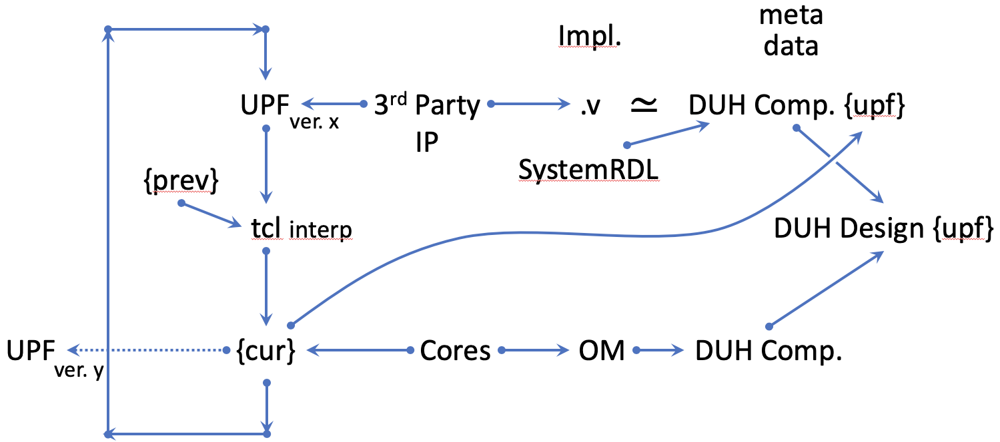

# upf

[UPF](https://en.wikipedia.org/wiki/Unified_Power_Format) tools

* JSON form of storing UPF
  - Human readble spec
  - JSON schema
* TCL interpreter
  - [tcl](https://github.com/nukedzn/node-tcl)
  - [tcl-js](https://github.com/rubikscraft/tcl-js)
* JSON -> TCL writer
